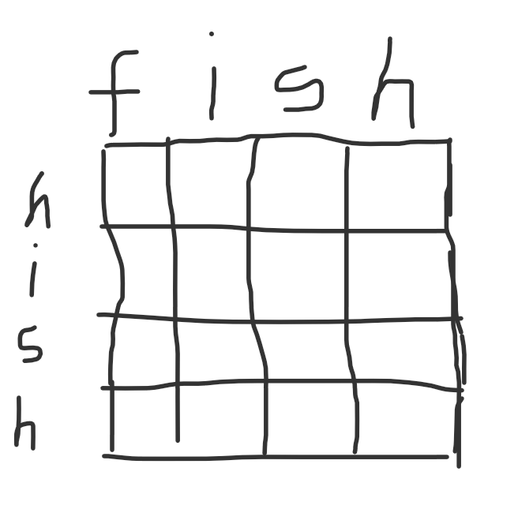
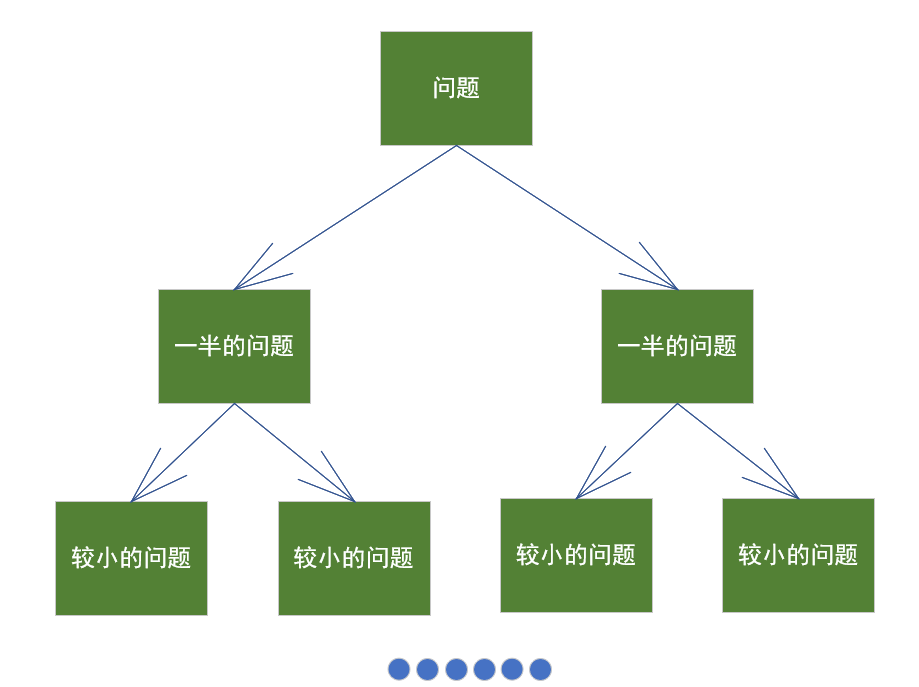
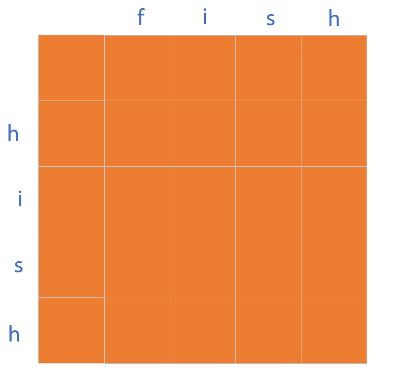
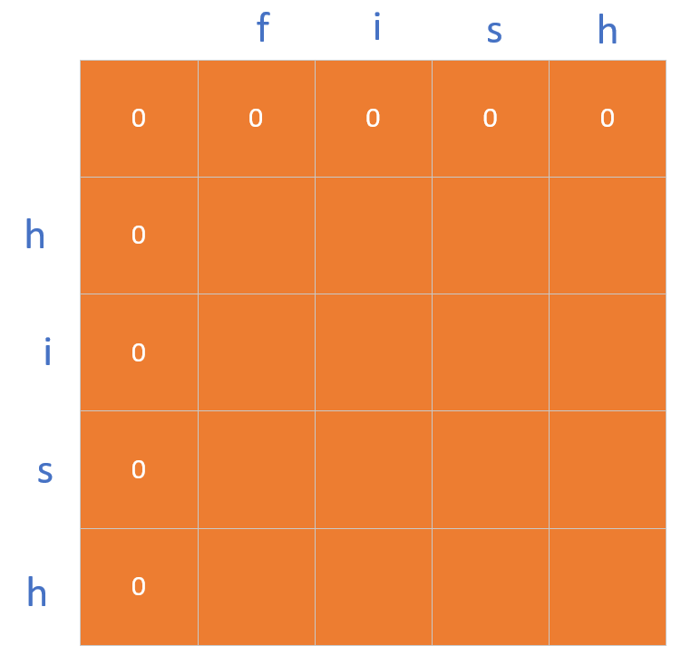
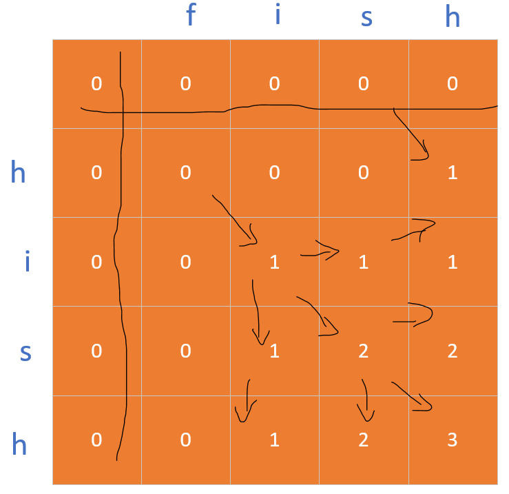
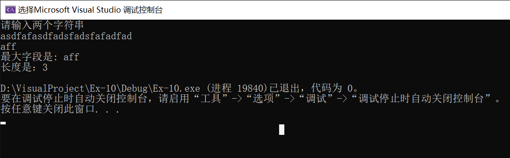

# 最长公共子序列

---

<h2 id="back"></h2>

### 目录
- [定义](#define)
- [问题引进](#questionout)
- [思想构成](#methodbuid)
- [动态规划](#dynamic)
- [解决问题](#solveproblem)
- [代码](#code)

---

接下来我们来学习一下最长公共序列。

<h2 id="define"></h2>

#### 定义

最长公共子序列,英文缩写为LCS(Longest Common Subsequence)。其定义是:一个序列S,如果分别是两个或多个已知序列的子序列,且是所有符合此条件序列中最长的,则S称为已知序列的最长公共子序列。

<h2 id="questionout"></h2>

#### 问题引进

> 首先我们引进一个问题:在一个计算机词典中,用户想要找一个单词,``fish``,但是用户不小心把单词拼写错误了,拼出了``hish``......这可怎么办。词典中当然没有``hish``这个单词,但是我们有``fish,finish``等单词,我们是不是应该去找这个单词呢?


对于这个问题,我们该.....怎么解决呢???

[------>这是返回<------](#back)

---

<h2 id="methodbuid"></h2>

#### 思想构成

##### 简述思想

- 对于这个问题.....我们不妨,可以通过比较他们的字符串,从而得到用户所需要的一个单词。就好比如说,``fish,finish``这两个单词都有``ish``这个字段,但用户输入的单词``(hish)``长度为``4``,那么....我们不可能去匹配``finish``这个单词,因为超出了用户拼写单词的最长长度.....
- 简而言之.....我们得从``fish``这个单词中匹配我们需要的单词。接下来.....便是怎么匹配的问题了。




##### 匹配思想

- 对于这个我们刚刚的简述的内容,我们边可以进行匹配了......(这是废话....)
- 匹配的思路大概是这样的: 
> 我们可以从第一个字符开始比,然后比对到最后一个字符。一一进行比较,一直到最后我们的所有的字符都完成,最后统计哪些字符串是比较接近的,然后我们进行输出....

- 对于上面的这个思路....只能说,可以实行但是复杂度很高,基本上接近了O( n^2^ )...我们是否有另一种思路去做这个问题?

[------>这是返回<------](#back)

---

<h2 id="dynamic"></h2>

#### 动态规划

了解一下动态规划:

- 动态规划可以帮助你在给定的约束条件下找到最优解。在背包问题中,我们可以在给定的背包容量的情况下,偷到价值最高的商品。
- 在问题可分解为彼此独立且离散的子问题,那么我们可以想一下这个大的问题能不能使用动态规划去解决。



我们再来学习一些小tips:

- 每种动态规划解决方案都涉及网格。
- 单元格中的值通常就是你要优化的值。
- 每个单元格都是一个子问题,因此你应该考虑如何将问题分成子问题,这有助于找出网络的坐标轴。

根据刚刚所说的一些动态规划的思想和tips,我们如果需要利用动态规划的话,我们得把这个问题分解成若干个子问题....

就好比如,我们找``fish``,输入了``hish``,那么我们得比较``h``和``fish``的匹配程度,然后还得分别比较``i``,``s``,``h``这几个,最后在进行合并,那么我们就可以求得``fish``和``hish``单词的匹配度。

这就是一个巫术......很难,我们想不出任何的思路。为什么不用``费曼算法``来解决呢?步骤如下:
- 将问题写下来
- 好好思考
- 将答案写下来


哈哈,不逗了,接下来我们来解决LCS(最长公共子序列)问题

[------>这是返回<------](#back)

---

<h2 id="solveproblem"></h2>

#### 解决问题

为了解决LCS问题,我们需要把原问题分解成若干个子问题,所以需要刻画LCS的特征。
- 设A="a0,a1,...,am",B="b0,b1,...,bn",且Z="z0,z1,...,zk",为他们的最长公共子序列。他们有如下的性质

> - 如果am=bn,则zk=am=bn,且"z0,z1,...,z(k-1)"是"a0,a1,...,a(m-1)"和"b0,b1,...,b(n-1)"的一个最长公共子序列
> - 如果am!=bn,则若zk!=am,蕴含"z0,z1,...,zk"是"a0,a1,...,a(m-1)"和"b0,b1,...,bn"的一个最长公共子序列
> - 如果am!=bn,则若zk!=bn,蕴含"z0,z1,...,zk"是"a0,a1,...,am"和"b0,b1,...,b(n-1)"的一个最长公共子序列

进行一系列的递归以及代入操作,我们得到了以下的递归公式。我们使用一个矩阵来进行运算......

```
		 | 0               			i==0||j==0
c[ i, j ]| c[i-1][j-1]+1        	i,j>0&&xi==yi
		 | max{c[i][j-1],c[i-1][j]} i,j>0&&xi!=yi
```

请看图示:









好了，以上便是最长字段的讲解了.......

在完成这个存储数的矩阵之后，最后一个元素的值便是我们需要求的的字符串的长度。这是运行图:



[------>这是返回<------](#back)

---

<h2 id="code"></h2>

### 接下来便是代码部分

```c++

#include<iostream>
#include<vector>
#include<cstdlib>
#include<string>
#include<stack>

using namespace std;

string MaxSegments(string& str1, string& str2);
string Process(int a, int b, string& str1, string& str2);
void Display(vector<vector<int>>& pos);
void Display(vector<vector<string>>& pos);

int main()
{

	string str1, str2, pos;
	cout << "请输入两个字符串" << endl;
	cin >> str1 >> str2;
	pos=MaxSegments(str1, str2);
	cout << "最大字段是: " << pos << endl;
	cout << "长度是：" << pos.size() << endl;

	return 0;
}

string MaxSegments(string &str1,string &str2)
{
	//根据大小来开放空间
	int a = str1.size();
	int b = str2.size();
	string pos;
	if (a > b)//当传进来的字符串1的长度比第二个长
	{
		pos = Process(a, b, str1, str2);
	}
	else//比第二个短
	{
		pos = Process(b, a, str2, str1);
	}
	return pos;
}

string Process(int a, int b, string& str1, string& str2)
{
	vector<vector<int>>Pair(a+1, vector<int>(b+1, 0));//用来存储最大长度
	vector<vector<string>>Graph(a+1, vector<string>(b+1, "0"));//用来存储走的路径
	stack<char>ans;
	string pos;
	for (int i = 0; i < a+1; i++)
	{
		for (int j = 0; j < b+1; j++)
		{
			if (i == 0 || j == 0)//这是条件方程
			{
				Pair[i][j] = 0;
				Graph[i][j] = "0";
			}
			else if ((i > 0 || j > 0) && (str1[i-1] == str2[j-1]))
			{
				Pair[i][j] = Pair[i - 1][j - 1] + 1;
				Graph[i][j] = "↖";
			}
			else
			{
				if (Pair[i - 1][j] > Pair[i][j - 1])
				{
					Pair[i][j] = Pair[i - 1][j];
					Graph[i][j] = "↑";
				}
				else
				{
					Pair[i][j] = Pair[i][j - 1];
					Graph[i][j] = "←";
				}
			}
		}
	}//经过之后，可以找到最长字串的个数了
	
	//Display(Pair);//测试的时候显示路径
	//Display(Graph);
	
	while (Graph[a][b] != "0")
	{
		if (Graph[a][b] == "↖")
		{
			ans.push(str1[a-1]);
			a--, b--;
		}
		else if (Graph[a][b] == "↑")
		{
			a--;
		}
		else if (Graph[a][b] == "←")
		{
			b--;
		}
	} 
	while (!ans.empty())
	{
		pos.push_back(ans.top());
		ans.pop();
	}
	return pos;
}

void Display(vector<vector<int>>& pos)
{
	for (int i = 0; i < pos.size(); i++)
	{
		for (int j = 0; j < pos[0].size(); j++)
		{
			cout << pos[i][j] << " ";
		}
		cout << endl;
	}
}
void Display(vector<vector<string>>& pos)
{
	for (int i = 0; i < pos.size(); i++)
	{
		for (int j = 0; j < pos[0].size(); j++)
		{
			cout << pos[i][j] << " ";
		}
		cout << endl;
	}
}

```

[------>这是返回<------](#back)


---

参考书籍《算法导论》、《算法图解》、百度百科
